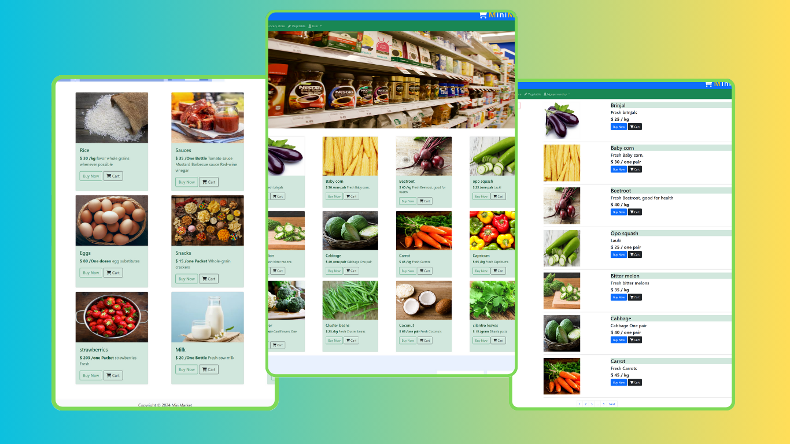

# MiniMarket E-commerce Web development project (frontend + backend) python Django

## Demo sao khi thành công chạy dự án


#### Để chạy dự án này trên máy tính của bạn
```shell
1: Cài đặt python django
````
```shell
2: git clone https://github.com/nguyenvanduydev001/minimaket.git
```
```shell
3: Mở thư mục dự án
```
```shell
4: Chắc chắn phải có một tập tin manage.py 
```
```shell
5: Tại cùng vị trí đó mở terminal hoặc powershell
```
```shell
6: Viết lệnh 'python manage.py runserver'
```
```shell
7: Mở trình duyệt
```
```shell
8: Gõ vào trang url 'localhost: 8000'
```
##### Chúc các bạn thành công 😁
